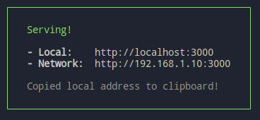

# Simple Virtual Vending Machine
## This application serves as a virtual vending machine. It works with a provided bulgarian currency denomination set. It is a single choice purchase type of operation. Here are some simple steps on how to use the gui:  
1. Insert as many coins and bills as you want from the right operations side panel. Keep in mind that the total amount of money you insert in the vending machine would be deducted from your virtual wallet.  
2. Select the product you desire and click on the "Buy" button underneath it  
3. As mentined in a little bit earlier, this is a single choice operation meaning that you can not buy multple items at the same time. This is actually how a standart vending machine works in real life too. Furthermore, the difference between your total balance and the price of the selected product will be returned as a change directly into your virtual wallet.  
4. If at any point you hesitate and change your mind, you could always withdraw all your money that were inserted into the machine clicking on the red `Eject` button.  
5. Keep in mind that there is a limited amount of products in the vending machine so choose wisely  
6. Have fun!  
  
## How to build and start the project
### Prerequisites
The project was developed using Node 16 (You could use `nvm` to easily install and switch between different versions of `node`). Additionally, the `OS` used was `OpenSUSE 15.3` and there should be no problems with the installation process on other Linux distrubitions. Follow these steps to build and observe the application:
1. Download in a directory of your choosing using any of the following: 
- Over SSH:
`git clone git@github.com:plamenpetkov8/Vending-Machine.git`
- over HTTP:
`git clone https://github.com/plamenpetkov8/Vending-Machine.git`
2. `npm install` from the root of the project  
3. `sudo npm run build` from the root of the project. `su` privileges needed and will create a new `./build` folder in the root as well  
4. `npm install -g serve` (It is a usefull tool that could be downloaded even `locally` if you desire. In the example given, it will be installed `globally`)  
5. `serve -s build` from the root of the project. In the terminal you could see a rectangle with a green border looking like this:  

  
6. Follow any of the addresses provided and enjoy the App!

### Coin denomination

The currency used in this project for purchasing is bulgarian leva. The vending machine is designed to work only with the following currency denomination:

- 1 stotinka (0.01 lv)
- 2 stotinki (0.02 lv)
- 5 stotinki (0.05 lv)
- 10 stotinki (0.1 lv)
- 20 stotinki (0.2 lv)
- 50 stotinki (0.5 lv)
- 1 lev (1 lv)
- 2 leva (2 lv)
- 5 leva (5 lv)
- 10 leva (10 lv)
- 20 leva (20 lv)
- 50 leva (50 lv)
